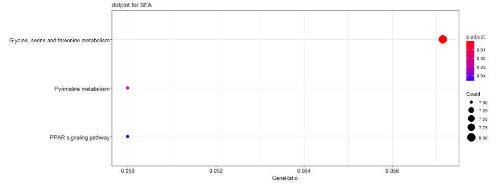
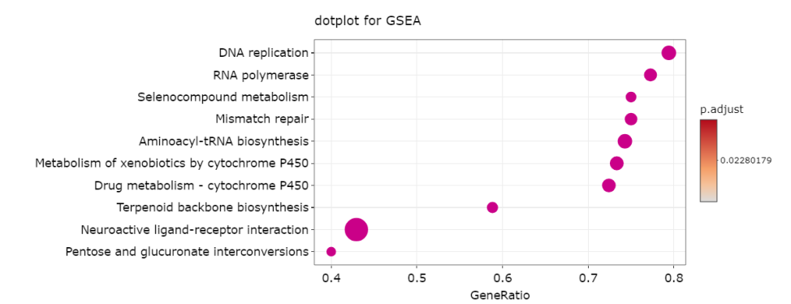
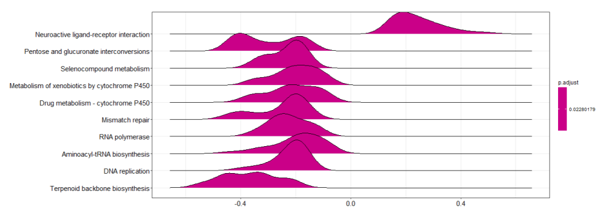
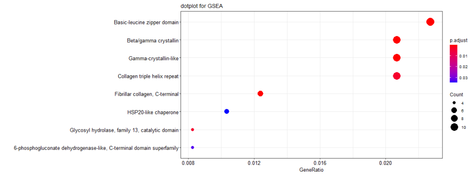
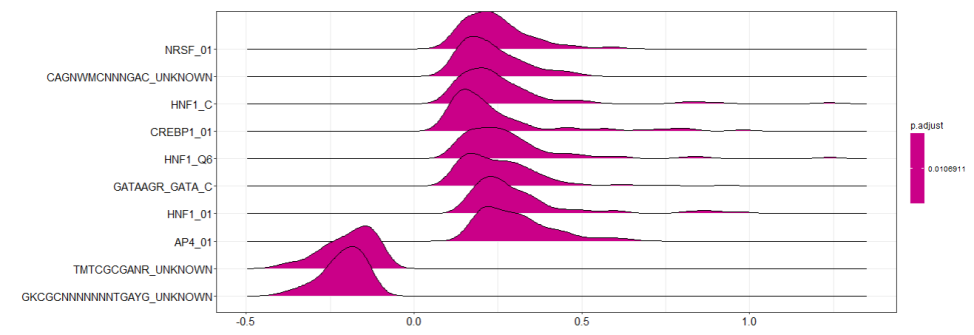
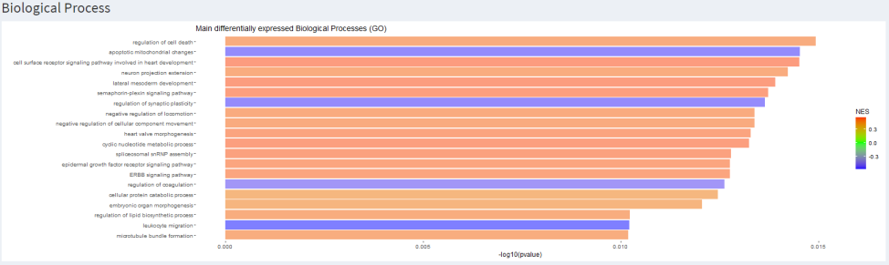
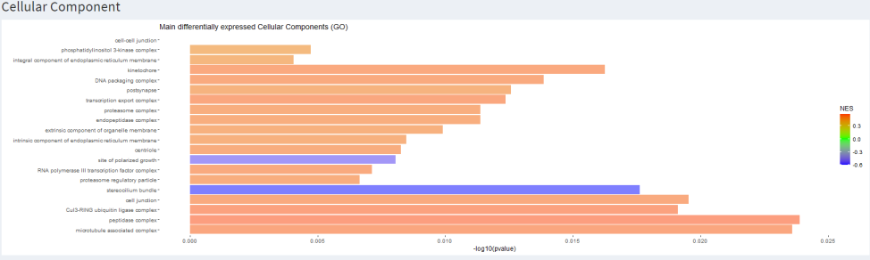
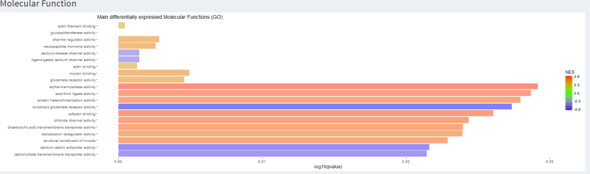

# EASE - Enrichment Analysis in a Shiny Environment

EASE is an application to study the comprehensive functional analysis of a large gene set with 3 important fields integration : Pathways, gene ontology and protein domains.
The application is composed of 4 parts : Whole data inspection, pathways, gene ontology and protein domains.

[Application video presentation ](https://youtu.be/lUbX-7zE8Ns)

*The Gene set enrichment analysis* ([GSEA](https://www.ncbi.nlm.nih.gov/pmc/articles/PMC1239896/)) is a method to identify classes of genes or proteins that are over-represented in a large set of genes or proteins. The method uses statistical approaches to identify significantly enriched or depleted groups of genes. 

The general steps of GSEA method are :
	1. Calculate the enrichment score (ES) that represents the amount to which the genes in the set are over-represented at either the top or bottom of the list. This score is a Kolmogorov–Smirnov-like statistic
	2. Estimate the statistical significance of the ES. This calculation is done by a phenotypic-based permutation test in order to produce a null distribution for the ES. The P value is determined by comparison to the null distribution
	3. Adjust for multiple hypothesis testing for when a large number of gene sets are being analyzed at one time. The enrichment scores for each set are normalized and a false discovery rate is calculated.

The GSEA method has been criticized for the fact that the Kolmogorov–Smirnov-like statistic is not as sensitive as the t-test statistic.

*The Simpler Enrichment Analysis* [SEA](https://www.ncbi.nlm.nih.gov/pmc/articles/PMC3758419/) method assumes gene independence and uses a simpler approach to calculate t-test. However, it is thought that these assumptions are in fact too simplifying, and gene correlation cannot be disregarded.

Input Format
---

csv or text/csv file only with "id" for gene ID, "padj" for p-values adjusted, "basemean" and "log2FoldChange" columns.

	#Choose the organism
	#Choose the id database origin from databases available for the organism 
	
PACKAGES - Installation
---

```R
anyLib.packages=c("shiny", "shinydashboard", "shinydashboardPlus", "shinycssloaders", "shinyalert", 
                  "ggplot2", "DT", "clusterProfiler", "enrichplot", "org.Dr.eg.db", "KEGG.db", "KEGGREST", 
                  "msigdbr", "dplyr", "pathview", "DOSE", "PPInfer")
anyLib::anyLib(anyLib.packages, autoUpdate = T)
```

Test dataset
---
The test [dataset](https://www.ncbi.nlm.nih.gov/geo/query/acc.cgi?acc=GSE129081) on Danio rerio (Zebrafish) is extracted from the following [paper](https://www.nature.com/articles/s41588-019-0475-y) published in Nature in 2019. 

How to run ?
---


	#Git Clone
	#Open ui.R on Rstudio
	#Run
	

Threshold selection
---

Users can choose and modify the threshold in the application

Whole data inspection
---


*File Browse : csv file with header*


	#Respect header order
	#Specifiy species


*Volcano Plot & MA plot*


	#Two sliders to specify log(CPM)cutoff and padj on the plots
	#Clickable points on plots to show line of the corresponding point


Pathways - SEA & GSEA
---

*Descriptive table of data*

	#Downloadable 
	#Clickable links


*Dot plot with pathways significantly enriched as a function of the gene ratio (number of genes in the dataset differentially expressed on the number of genes that make up the pathway)*

	#Specifiy number of category





*Pathway Viewer*

	#drop-down list to choose pathway to see


*GSEA only Ridge plot*

	#Specifiy number of category





Domains - SEA & GSEA
---

*Descriptive table*

	#Downloadable 
	#Clickable links

*Dot plot with domains significantly enriched as a function of the gene ratio (number of genes in the dataset differentially expressed on the number of genes that make up the pathway)*

	#Specifiy number of category





*Bonus with patterns for GSEA*

	#Descriptive table
	#Dot plot
	#Ridge plot




GO 
---

*Representation of main differentially expressed Biological Processes*
	
	# SEA Histogram with corresponding descriptive table 
	# GSEA Barplot with correspondong descriptive table 





*Representation of main differentially expressed Cellular Component*

	# SEA Histogram with corresponding descriptive table 
	# GSEA Barplot with correspondong descriptive table





*Representation of main differentially expressed Molecular function*
	
	# SEA Histogram with corresponding descriptive table 
	# GSEA Barplot with correspondong descriptive table




Be carreful
---

A genome that is poorly or badly annotated will not allow a correct enrichment analysis because the detection of the genes will be too weak. Indeed, each database does not have annotations for all the information of another, for example ENSEMBL has many annotations that NCBI does not have, hence a lack in the conversion. In the case of conversion between two databases, the number of genes can drastically affect the integrity of the data and therefore conclusions cannot be guaranteed

## Authors

Projet réalisé dans le cadre scolaire au cours du M2.1 BIMS de l'université de Rouen 2019-2020

Jerôme Arnoux

Chloé Beaumont

Alba Caparros-Roissard

Florian Jeanneret

Maud Repellin
