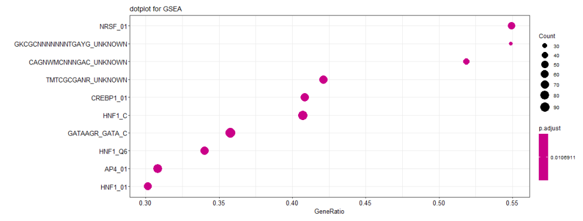
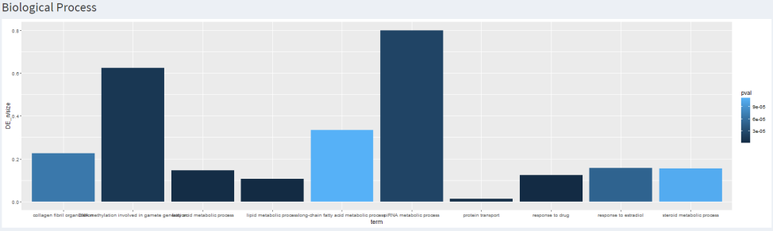
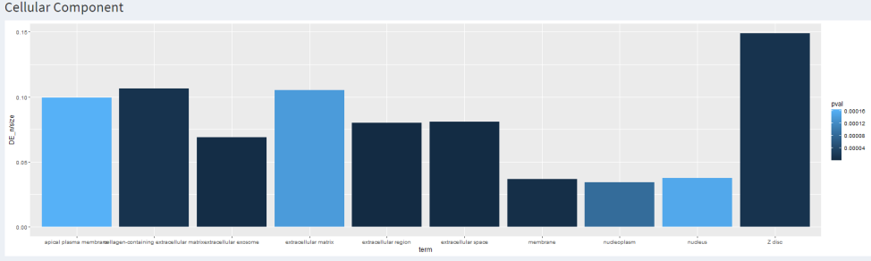
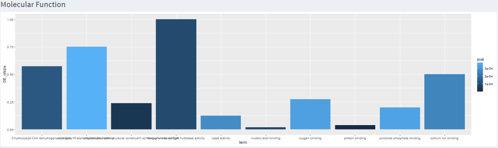

Shiny Project
===

## Table of Contents

[TOC]

Summary
---

*File Browse : csv file with header*
id Gene	baseMean log2FoldChange pvalue padj Biotype Orthologous_human_gene

	#Respect header order
	#Specifiy specie

*Volcano Plot & MA plot*

	#Two sliders to specify log(CPM)cetoff and padj on the plots
	#clickable point on plots to show line af the corresponding point

Pathways - SEA & GSEA
---

*Descriptive table of data*

	#Donwloadable 
	#Clickable links

*Dot plot with pathways significantly enriched as a function of the gene ratio (number of genes in the dataset differentially expressed on the number of genes that make up the pathway)*
	#Specifiy number of category

*Pathway Viewer*
	#drop-down list to choose pathway to see

*GSEA only Ridge plot*
	#Specifiy number of category

Domains - SEA & GSEA
---

*Descriptive table*

	#Donwloadable 
	#Clickable links

*Dot plot with domains significantly enriched as a function of the gene ratio (number of genes in the dataset differentially expressed on the number of genes that make up the pathway)*

	#Specifiy number of category

*Bonus with patterns for GSEA*

	#Descriptive table
	#Dot plot
	#Ridge plot

GO 
---

*Representation of main differentially expressed Biological Processes*
	# SEA Histogram with corresponding descriptive table 
	# GSEA Barplot with correspondong descriptive table 

*Representation of main differentially expressed Cellular Component*
	# SEA Histogram with corresponding descriptive table 
	# GSEA Barplot with correspondong descriptive table

*Representation of main differentially expressed Molecular fonction*
	# SEA Histogram with corresponding descriptive table 
	# GSEA Barplot with correspondong descriptive table

## Appendix and FAQ

:::info
**Find this document incomplete?** Leave a comment!
:::

